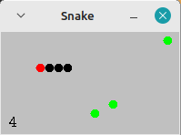

# Snake - Jeu du Serpent

Petit jeu créer en java pour progresser avec une étape par étape.

## Installation

Ce jeu est issu du tutoriel en ligne de Maciej Piekarski, accessible sur Youtube [ICI](https://www.youtube.com/watch?v=PifAQCY7cro)

Pour lancer le jeu vous aurez besoin d'un environnement de développement (IDE) ainsi que de la JVM, de cloner le repo et ensuite exporter le projet en .jar 

(ou juste l'ouvrir avec le start de votre IDE)

Le jeu comprend une classe main : Snake.java qui va apeler la classe Fenetre.
Celle-ci s'occupe de l'affichage ainsi que de l'instanciation de notre serpent.

La classe Serpent va jouer avec les objets Pomme et Anneau pour implémenter la logique du jeu.

